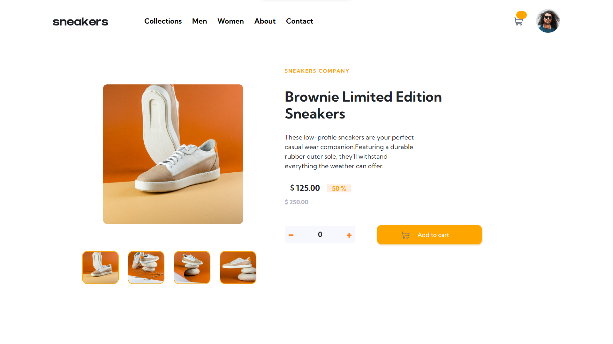
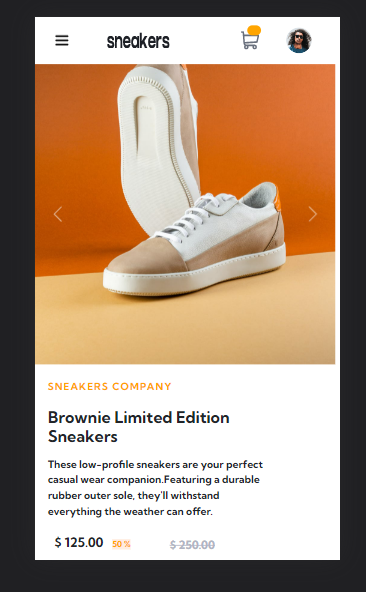
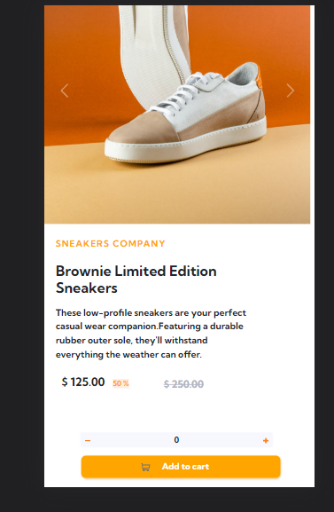
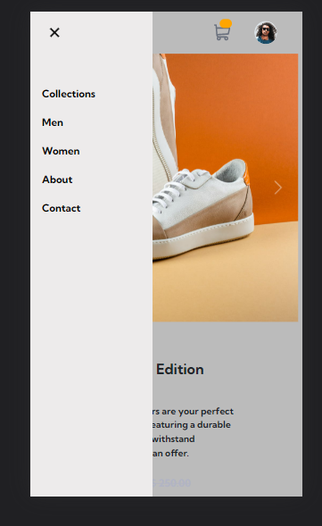

# Frontend Mentor - E-commerce product page solution

This is a solution to the [E-commerce product page challenge on Frontend Mentor](https://www.frontendmentor.io/challenges/ecommerce-product-page-UPsZ9MJp6). Frontend Mentor challenges help you improve your coding skills by building realistic projects.

## Table of contents

- [Overview](#overview)
  - [The challenge](#the-challenge)
  - [Screenshot](#screenshot)
  - [Links](#links)
  - [Built with](#built-with)
  - [Useful resources](#useful-resources)

## Overview

### The challenge

Users should be able to:

- View the optimal layout for the site depending on their device's screen size
- See hover states for all interactive elements on the page
- Open a lightbox gallery by clicking on the large product image
- Switch the large product image by clicking on the small thumbnail images
- Add items to the cart
- View the cart and remove items from it

### Screenshot

### Links

- Solution URL: [Add solution URL here](https://github.com/code-brownie/E-commerce-Website)
- Live Site URL: [Add live site URL here](https://code-brownie.github.io/E-commerce-Website/)
### Built with

- Semantic HTML5 markup
- CSS custom properties
- Flexbox
- Bootstrap
- Javascript

### Useful resources

- [Example resource 1](https://lokeshdhakar.com/projects/lightbox2/) - This helped me in adding Lightbox Gallery. I really liked this pattern and will use it going forward.
- [Example resource 2](https://getbootstrap.com/docs/4.0/components/carousel/) - This helped me in adding carousel in my Webpage.

